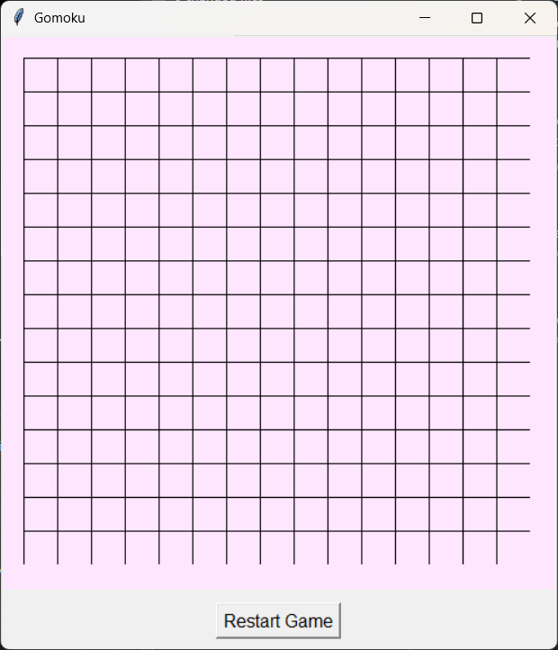
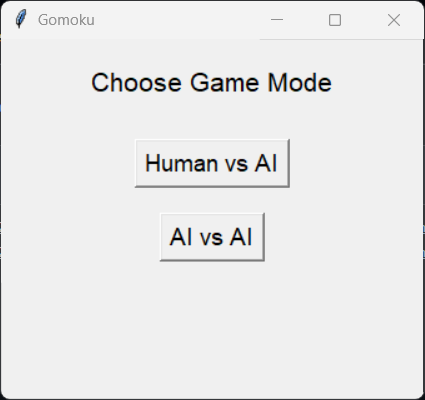

# ♟️ Gomoku Game (Five in a Row)

### 🎮 Description
A Python-based Gomoku game with two modes:
- 🧠 **AI vs Human**: Play against a Minimax-based AI.
- ⚔️ **AI vs AI**: Watch Minimax AI play against Alpha-Beta Pruning AI.

The GUI is implemented using Tkinter for an interactive and user-friendly experience.

---

### 🧠 Algorithms Used

- **Minimax** Algorithm for AI decision-making.
- **Alpha-Beta Pruning** to optimize AI performance in AI vs AI mode.

---

### 🖼️ Screenshots

#### 🏠 Game Board


####   🧩 Menu (Choose Mode)

Select between:
- 🤖 AI vs AI
- 🧍 Human vs AI


---

### 🛠️ Technologies Used

- Python
- Tkinter
- Minimax Algorithm
- Alpha-Beta Pruning

---

### 🚀 How to Run

```bash
python gomoku.py
